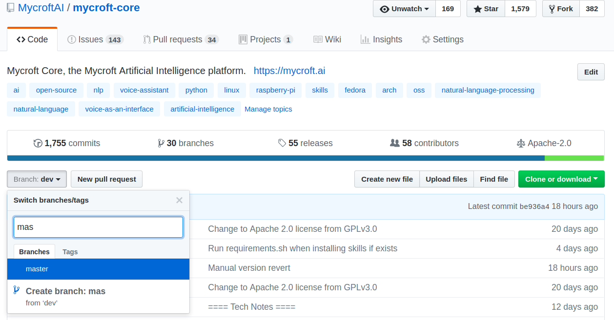

# Mycroft for Linux

Mycroft is available for Linux, and can be installed via several methods.

Currently, there are builds and/or instructions for installing Mycroft on:

* Debian / Ubuntu
* Arch
* Mint
* KDE Plasmoid

### Prerequisites

This section of documentation assumes the following:

* That you already have Linux installed on your computer
* That your computer is already connected to the internet
* That you are comfortable issuing basic Linux commands from a **terminal** or **shell prompt**
* That your device has a built-in microphone and speakers, or, you have successfully connected microphone and speakers to your device.
* That your device already has `git` installed and working. If you don't already have `git` installed, [here is a great set of instructions](https://gist.github.com/derhuerst/1b15ff4652a867391f03).

@TODO do we need to comment here on whether bluetooth or USB is a better connection choice for headphones and speakers?

### Getting Started

There are multiple ways to install Mycroft for Linux.

#### Installing via git clone

The simplest way to install Mycroft for Linux is to clone the `mycroft-core` repo to your system and run a shell script, which will install all dependencies, and [Mycroft components](../01.about-mycroft/01.about-mycroft.md).

The instructions below will install Mycroft in your HOME directory.

```
cd ~/
git clone https://github.com/MycroftAI/mycroft-core.git
cd mycroft-core
bash dev_setup.sh
```

The `dev_setup.sh` script identifies, installs and configures dependencies that Mycroft needs to run.

The script will also install and configure [virtualenv](https://virtualenv.pypa.io/en/stable/). `virtualenv` is a tool to create isolated Python environments. It is a way to isolate an application - in this case Mycroft - from other applications. It helps to better manage both dependencies and security.

If you are running a Linux distribution other than Ubuntu, Debian, Arch or Fedora, you may need to manually install packages as instructed by `dev_setup.sh`.


_NOTE: The default branch for this repository is 'dev', which should be considered a work-in-progress. If you want to clone a more stable version, switch over to the 'master' branch._

You can do this by choosing the `master` branch in GitHub instead of the default `dev` branch as shown below.



#### Other installation options

@TODO what are the other installation options for Mycroft on Linux - there are the installers that @AIIX provided, and I think there's an `apt-get` package. Will need to clarify.

### Running Mycroft for Linux

The Mycroft for Linux installation includes two scripts that you use to control Mycroft services.

#### start-mycroft.sh

@TODO this needs to be better documented - give examples of usage of each of the commands.

`start-mycroft.sh` is used to start one, or all, Mycroft services. This script uses the `virtualenv` created by `dev_setup.sh`.

Mycroft provides start-mycroft.sh to perform common tasks. This script uses a virtualenv created by dev_setup.sh. Assuming you installed mycroft-core in your home directory run:

cd ~/mycroft-core
./start-mycroft.sh debug
The "debug" command will start the background services (microphone listener, skill, messagebus, and audio subsystems) as well as bringing up a text-based Command Line Interface (CLI) you can use to interact with Mycroft and see the contents of the various logs. Alternatively you can run ./start-mycroft.sh all to begin the services without the command line interface. Later you can bring up the CLI using ./start-mycroft.sh cli.

The background services can be stopped as a group with:

./stop-mycroft.sh

### Pairing Mycroft for Linux

Once successfully installed, you will need to **pair** your Mycroft for Linux **Device** with your [home.mycroft.ai](https://home.mycroft.ai) account.

Speak
`hey mycroft, pair my device`

Mycroft will Speak
`I am connected to the internet and need to be paired. Your 6-digit **Registration Code** is XXXXXX`

Use the **Registration Code** to pair your Mycroft for Linux **Device** with home.mycroft.ai.

[View the home.mycroft.ai documentation to learn how to add your **Device** to home.mycroft.ai](/03.your-home.mycroft.ai-account/01.your-home.mycroft-account.md).

#### Keeping Mycroft for Linux updated

@TODO Not sure what the easiest way is to keep Mycroft for Linux updated - is it as simple as doing a `git pull` from the remote repo?

### Common issues with Mycroft for Linux

@TODO link to Troubleshooting
