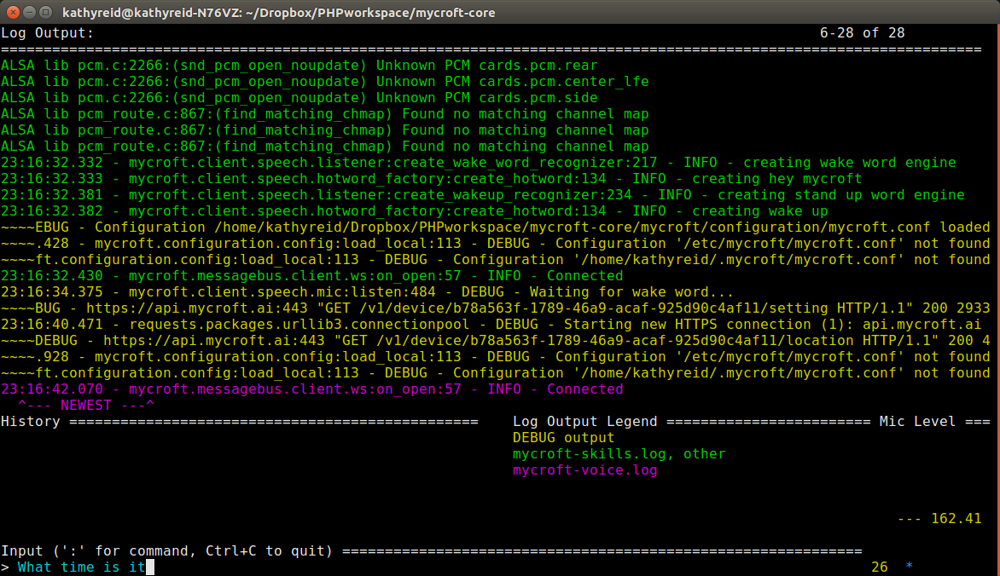

## Developing a new **Skill**

This page will walk you through developing a new Mycroft **Skill**. It assumes you have read through the [basic skills information](skills.md)

### Prerequisites

It's a good idea to get prepared before writing your new **Skill**, as this will make your skill-writing experience go much smoother.

* **Git** - You will need to know some basic Git commands in order to create a new **Skill** for Mycroft. If you're not familiar with Git, that's OK, but you _will_ need to have [Git installed on your system. ](https://git-scm.com/book/en/v2/Getting-Started-Installing-Git).
* **Python** - You will need to know some basic Python programming to get started. If you've programmed in other object-oriented languages, like Javascript or C#, then you'll be able to pick it up, but if you're totally new to programming, you'll need to do an [introductory programming course](https://www.edx.org/course/introduction-computer-science-mitx-6-00-1x-11).
* **Naming your Skill** - Choose a name for your **Skill** before creating a new repository. It's a good idea to check the [Mycroft Skills Repo](https://github.com/MycroftAI/mycroft-skills) so that you don't create a duplicate name.
* **Set up your environment** - Most people will find it easiest to test new **Skills** by setting up [Mycroft for Linux](Mycroft-for-Linux.md). `cd` into the directory where you have `mycroft-core` installed and type `/start_mycroft.sh debug`. This should open a command line interface (CLI) like that shown below:



* **Understand the flow of your Skill** - It's a good idea to write down on paper how your **Skill** will work, including
  * What words will the User speak to activate the **Skill**?
  * What will Mycroft speak in response?
  * What data will you need to deliver the **Skill**?
  * Will you need any additional packages or dependencies?

Once you've given these some thought, you can get started.

### Skill terminology

You'll notice some new terms as you start to develop **Skills**.

* **dialog** - A **dialog** is a phrase that is spoken by Mycroft. Different **Skills** will have different **dialogs**, depending on what the **Skill** does. For example, in a _weather_ **Skill**, a **dialog** might be `the.maximum.temperature.is.dialog`.
* **intent** - Mycroft matches **utterances** that a User speaks with a **Skill** by determining an **intent** from the **utterance**. For example, if a User speaks `Hey Mycroft, what's the weather like in Toronto?` then the **intent** will be identified as _weather_ and matched with the _Weather Skill_. When you develop new **Skills**, you need to define new **intents**.
* **utterance** - An **utterance** is a phrase spoken by the User, after the User says the **Wake Word**. `what's the weather like in Toronto?` is an **utterance**.

### Make a new repo using the Template Skill

First, `git clone` the [Mycroft Skills repo](https://github.com/MycroftAI/mycroft-skills/) to your local machine.

```bash
$ git clone https://github.com/MycroftAI/mycroft-skills.git
Cloning into 'mycroft-skills'...
remote: Counting objects: 1529, done.
remote: Compressing objects: 100% (60/60), done.
remote: Total 1529 (delta 42), reused 46 (delta 15), pack-reused 1451
Receiving objects: 100% (1529/1529), 7.44 MiB | 565.00 KiB/s, done.
Resolving deltas: 100% (709/709), done.
Checking connectivity... done.
```

Now, we'll made a new repository for your **Skill**. The new repository has to follow a strict file structure. A **Template Skill** is available to clone from. If you're new to GitHub, you might find this guide on [how to make a repo](https://help.github.com/articles/create-a-repo/) useful.

[Example Skill Template](https://github.com/MycroftAI/mycroft-skills/tree/master/00__skill_template)  

Copy the Template Skill into a new directory. Here, we've called the new Skill `skill-training`, but your **Skill** will have a different name.

```bash
$ cp -R 00__skill_template skill-hello-worldls -las
```

#### Structure of the **Skill** repo

The structure of the **Template Skill** directory looks like this:

```
$ ls -las
total 128
 8 drwxrwxr-x   5 kathyreid kathyreid  4096 Oct 27 00:22 .
 8 drwxrwxr-x 136 kathyreid kathyreid  4096 Oct 27 00:22 ..
 8 drwxrwxr-x   3 kathyreid kathyreid  4096 Oct 27 00:22 dialog
 8 -rw-rw-r--   1 kathyreid kathyreid  3768 Oct 27 00:22 __init__.py
56 -rw-rw-r--   1 kathyreid kathyreid 49360 Oct 27 00:22 LICENSE
 8 -rw-rw-r--   1 kathyreid kathyreid   187 Oct 27 00:22 README.md
 8 -rw-rw-r--   1 kathyreid kathyreid   116 Oct 27 00:22 requirements.sh
 8 -rw-rw-r--   1 kathyreid kathyreid    79 Oct 27 00:22 requirements.txt
 8 drwxrwxr-x   3 kathyreid kathyreid  4096 Oct 27 00:22 test
 8 drwxrwxr-x   3 kathyreid kathyreid  4096 Oct 27 00:22 vocab
 ```

##### `dialog` directory

The `dialog` directory contains subdirectories for each spoken language the skill supports.  Each subdirectory has `.dialog` files which specify what Mycroft should say when a **Skill** is executed.

The subdirectories are named using the [IETF language tag](https://en.wikipedia.org/wiki/IETF_language_tag) for the language. For example, Brazilian Portugues is `pt-br`, German is `de`, and Australian English is `en-au`.

Here is an example where one language is supported. By default, the **Template Skill** contains one subdirectory for United States English - `en-us`. If more languages were supported, then there would be additional language directories.

```bash
$ ls -las -R
.:
total 24
8 drwxrwxr-x 3 kathyreid kathyreid 4096 Oct 27 23:32 .
8 drwxrwxr-x 6 kathyreid kathyreid 4096 Oct 27 23:32 ..
8 drwxrwxr-x 2 kathyreid kathyreid 4096 Oct 27 23:32 en-us

./en-us:
total 40
8 drwxrwxr-x 2 kathyreid kathyreid 4096 Oct 27 23:32 .
8 drwxrwxr-x 3 kathyreid kathyreid 4096 Oct 27 23:32 ..
8 -rw-rw-r-- 1 kathyreid kathyreid   32 Oct 27 23:32 hello.world.dialog
8 -rw-rw-r-- 1 kathyreid kathyreid   91 Oct 27 23:32 how.are.you.dialog
8 -rw-rw-r-- 1 kathyreid kathyreid   88 Oct 27 23:32 welcome.dialog
```

There will be one file in the language subdirectory (ie. `en-us`) for each type of **dialog** the **Skill** will use. In the example above, there are three types of **dialog** used by the **Skill**. Let's take a look at a **dialog** file.

```bash
$ cat hello.world.dialog
Hello world
Hello
Hi to you too
```

You will notice that each line of **dialog** is slightly different. When instructed to use a particular **dialog**, Mycroft will chose one of these lines at random. This is closer to natural speech. That is, many similar phrases mean the same thing.

For example, how do you say 'goodbye' to someone?
* Bye for now
* See you round
* Catch you later
* Goodbye
* See ya!

##### vocab directory and defining Intents

Each **Skill** defines one or more **Intents**. Intents are defined in the `vocab` directory.The `vocab` directory is organized by language, just like the `dialog` directory.  

In this example, we can see that there are three **Intents**, each defined in `IntentKeyword.voc` **vocab** files:

```bash
mycroft-skills/skill-hello-world/vocab/en-us$ ls -las
total 40
8 drwxrwxr-x 2 kathyreid kathyreid 4096 Nov  9 00:11 .
8 drwxrwxr-x 3 kathyreid kathyreid 4096 Nov  9 00:11 ..
8 -rw-rw-r-- 1 kathyreid kathyreid   22 Nov  9 00:11 HelloWorldKeyword.voc
8 -rw-rw-r-- 1 kathyreid kathyreid   52 Nov  9 00:11 HowAreYouKeyword.voc
8 -rw-rw-r-- 1 kathyreid kathyreid   17 Nov  9 00:11 ThankYouKeyword.voc
```

Just like **dialog** files, **vocab** files can have multiple lines. Mycroft will match _any_ of these phrases with the **Intent**. If we have a look at the `ThankYouKeyword.voc` file, we can see this in action:

```bash
$ cat ThankYouKeyword.voc
thank you
thanks
```

If the User speaks _either_ `thank you` or `thanks`, Mycroft will match this to the `ThankYou` **intent** in the **Skill**.

_NOTE: One of the most common mistakes when getting started with **Skills** is that the **vocab** file doesn't include all the phrases that the User might use to trigger the **intent**. _

#### `__init__.py`

`__init__.py` is where most of the **Skill** is defined, using Python code.

@TODO talk here about the Copyright notice

Let's take a look:

```python
from adapt.intent import IntentBuilder
from mycroft.skills.core import MycroftSkill
from mycroft.util.log import getLogger
```

This section of code imports the required _libraries_. These libraries will be required on every **Skill**. Your skill may need to import additional libraries.

```python
__author__ = 'eward'
```

This section defines the _author_ of the **Skill**. This value is usually set to the GitHub username of the author.


```python
LOGGER = getLogger(__name__)
```

This section starts logging of the **Skill** in the `mycroft-skills.log` file. If you remove this line, your **Skill** will not log any errors, and you will have difficulty debugging.

The `class` definition extends the `MycroftSkill` class:

```python
class HelloWorldSkill(MycroftSkill):
```

The class should be named logically, for example `TimeSkill`, `WeatherSkill`, `NewsSkill`, `IPaddressSkill`. If you would like guidance on what to call your **Skill**, please join the [~skills Channel on Mycroft Chat](https://chat.mycroft.ai/community/channels/skills).

Inside the class, methods are then defined.

```python
def __init__(self):
        super(HelloWorldSkill, self).__init__(name="HelloWorldSkill")
```

This method is the _constructor_, and the key function it has is to define the name of the **Skill**.

```python    
def initialize(self):
        thank_you_intent = IntentBuilder("ThankYouIntent"). \
            require("ThankYouKeyword").build()
        self.register_intent(thank_you_intent, self.handle_thank_you_intent)

        how_are_you_intent = IntentBuilder("HowAreYouIntent"). \
            require("HowAreYouKeyword").build()
        self.register_intent(how_are_you_intent,
                             self.handle_how_are_you_intent)

        hello_world_intent = IntentBuilder("HelloWorldIntent"). \
            require("HelloWorldKeyword").build()
        self.register_intent(hello_world_intent,
                             self.handle_hello_world_intent)
```

The `initialize()` function defines each of the **Intents** of the **Skill**. Note that there are three **Intents** defined in `initialize()`, and there were three **Intents** defined in **vocab** files.

Next, there are methods that handle each of the **Intents**.
@TODO are they called methods or functions in Python? IDK. It's a `class` so I'm guessing they're `class methods`?

```python
def handle_hello_world_intent(self, message):
        self.speak_dialog("hello.world")
```

In the `handle_hello_world_intent()` method above, the method receives two _parameters_, `self` and `message`. `self` is the reference to the object itself, and `message` is an incoming message from the `messagebus`. This method then calls the `speak_dialog()` method, passing to it the `hello.world` dialog. Remember, this is defined in the file `hello.world.dialog`. Can you guess what Mycroft will Speak?

@TODO is this correct - is this what `message` is here? This was just totally an educated guess.

You will usually also have a `stop()` method. This method tells Mycroft what to do if a `stop` **intent** is detected.

```python
def stop(self):
    pass
```

In the above code block, the [`pass` statement](https://docs.python.org/2/reference/simple_stmts.html#the-pass-statement) is used as a placeholder; it doesn't actually have any function. However, if the **Skill** had any active functionality, the `stop()` method would terminate the functionality, leaving the *Skill** in a known good state.

## How do I find more information on Mycroft functions?

You can find documentation on Mycroft functions and helper methods at the [Mycroft Core API documentation](http://mycroft-core.readthedocs.io/en/stable)
