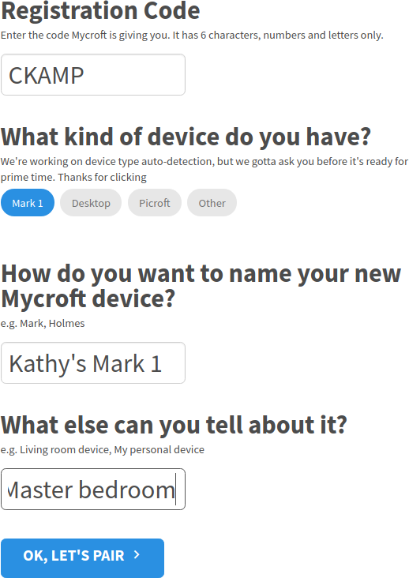

# Your home.mycroft.ai account

- [Your home.mycroft.ai account](#your-homemycroftai-account)
  * [Creating a home.mycroft.ai account](#creating-a-homemycroftai-account)
  * [home.mycroft.ai settings](#homemycroftai-settings)
    + [Advanced settings](#advanced-settings)
      - [Changing your Wake Word](#changing-your-wake-word)
    + [Telling Mycroft to pick up the new settings](#telling-mycroft-to-pick-up-the-new-settings)
  * [Adding a Device](#adding-a-device)
    + [Getting a Registration Code from a Mark 1](#getting-a-registration-code-from-a-mark-1)
    + [Getting a Registration Code from a Picroft](#getting-a-registration-code-from-a-picroft)
    + [Getting a Registration Code from Linux](#getting-a-registration-code-from-linux)
    + [How Mycroft speaks the Registration Code](#how-mycroft-speaks-the-registration-code)
  * [Pairing your Device(s) to your home.mycroft.ai account](#pairing-your-devices-to-your-homemycroftai-account)
  * [Where is my identity information shared in the Mycroft code?](#where-is-my-identity-information-shared-in-the-mycroft-code)

Each of your Mycroft **Device(s)** must be **Paired** with your [home.mycroft.ai](https://home.mycroft.ai) account.

Pairing makes information available to your Device to personalise your experience, such as which units of measurement you prefer, and your general location.

Pairing is also used for services that require API authentication, such as

* Wolfram Alpha
* Google Speech to Text
* Weather Skill API and OpenWeather

## Creating a home.mycroft.ai account

You can [create a home.mycroft.ai account](https://home.mycroft.ai/#/signup) by using

* Your Facebook account or;
* Your Google account or;
* Your GitHub account or;
* By signing up with your email address and choosing a password

## home.mycroft.ai settings

Choose 'Settings' from the top menu. Basic Settings will be displayed. These allow you to choose your preferred:

* Units of measurement (_NOTE: choosing Miles instead of Kilometers will also switch your temperature format to Fahrenheit instead of Celsius_)
* Date format
* Time format

All your Mycroft devices will use this information to tailor your experience.

If you do make changes, don't forget to save them using the button at the top of the page.

### Advanced settings

In Advanced Settings, you can configure:

* **The Speech to Text (STT) engine Mycroft uses** - By default, the Mycroft engine will be used, however you are free to choose others.
* **The Text to Speech (TTS) engine Mycroft uses** - By default, the Mimic engine will be used, however you are free to choose others.
* **Voice** - By default, Mycroft will use the `Male (KAL)` voice, however you are free to choose other voices.
* **Listener** - The Listener settings are used to tell Mycroft how to detect the **Wake Word** - the phrase Mycroft responds to when commands are issued. By default, this phrase is `hey mycroft`. Phrases are represented in TTS using **phonemes**.

Phonemes are basic units of sound. They are a way to represent the different sounds in speech in a standard way. English spelling varies so much that it cannot be used for this purpose. For example, the "j" sound in "juice" is the same as the "g" sound in "giant".

You can see the similarity when these words are written as phonemes:

* `JH UW S .`
=  juice

* `JH AY AH N T .`
= giant

The period, or full stop, indicates the end of the word.

To learn more about phonemes, see the [CMU Dictionary](http://www.speech.cs.cmu.edu/cgi-bin/cmudict). The Listener settings also include *threshold*, *threshold multiplier* and *dynamic energy ratio* settings. Unless you want to change your Wake Word, these should be left at their default settings.

If you do make changes, don't forget to save them using the button at the top of the page.


#### Changing your Wake Word

The Advanced Settings allow you to change the **Wake Word** that Mycroft responds to. You might want to change the **Wake Word** to a phrase that's easier for you to speak, or more culturally appropriate.

First, choose the phrase that you wish to set as your **Wake Word**. For the purposes of this example, we're going to use the phrase:

`yo mike`

instead of

`hey mycroft`

We then need to identify the **phoneme** sounds for this **Wake Word** using the [CMU Dictionary](http://www.speech.cs.cmu.edu/cgi-bin/cmudict).

`Y OW . M AY K .`

Remember that the period, or full stop, indicates the end of a word.

This information is then entered into the Advanced Settings on home.mycroft.ai.

Other settings are available to further tune how sensitive the Speech to Text (STT) engine is in recognizing the **Wake Word**.

* **Sample rate (Hz)**: The rate at which the audio stream is sampled. The default is 16KHz. You shouldn't need to change this, unless the microphone you are using needs a much higher or lower sample rate.

* **Channels**: The audio channel that should be sampled for the **Wake Word**. The default is 1, and you shouldn't have to change this unless your microphone is not operating on audio channel 1.

* **Wake Word**: In plain English text, the Wake Word that Mycroft should listen for.

* **Phonemes**: The **phonemes** corresponding to the **Wake Word**. If your Wake Word phrase is more than one word, remember to include a period (.) at the end of each phoneme.

* **Threshold (scientific notation)**: The level of sensitivity at which the **Wake Word** should trigger Mycroft to respond. To *increase* the sensitivity, *reduce* the Threshold. The Threshold is given in [scientific notation](https://en.wikipedia.org/wiki/Scientific_notation). Use this [handy converter](http://www.easysurf.cc/scintd.htm) to convert between decimal and scientific notation.

* **Threshold multiplier (float)**: This multiplier acts on the **Threshold**, and may be an easier way to make adjustments rather than scientific notation.

* **Dynamic Energy Ratio (float)**: Dynamic Energy Ratio (DER) is one signal feature used in [speech recognition](https://en.wikipedia.org/wiki/Speech_recognition) to identify characteristics of audio, such as whether a person has stopped or started speaking. DER is similar to signal-to-noise-ratio. A high ratio indicates a high difference in signal between speech and no speech, and a low ratio indicates a small difference in signal between speech and no speech.

If Mycroft is being *too sensitive*, reduce this value. If Mycroft *is not being sensitive enough*, increase this value.

### Telling Mycroft to pick up the new settings

Mycroft doesn't automatically fetch the new settings. You need to tell Mycroft to fetch the new settings by speaking

> Hey Mycroft, configuration update

Mycroft will then pull the new Settings configuration down.

## Adding a Device

To add a Device to your home.mycroft.ai account, you will need a 6-character **Registration Code**. The Registration Code is provided in different ways depending on which **Device** you have.

### Getting a Registration Code from a Mark 1

After you have connected your Mark 1 to Wifi, Mycroft will speak a 6-character **Registration Code**. This code will also appear on Mycroft's LED screen.

If you're stuck connecting to Wifi, please read the [Mark 1 Getting Started Guide (PDF, 290Kb)](https://mycroft.ai/wp-content/uploads/2017/06/Mark_1_User_Guide.pdf).

### Getting a Registration Code from a Picroft

After you have connected your Picroft to Wifi, Mycroft will speak a 6-character **Registration Code**.

If you're stuck connecting to Wifi, please read the [Picroft documentation](Picroft.md).

### Getting a Registration Code from Linux

After your Mycroft for Linux installation is successfully installed, Mycroft will speak a 6-character **Registration Code**.

### How Mycroft speaks the Registration Code

Mycroft will speak the code like this (ie. for the Registration Code CKAMP7 - your code will be different):

```
I'm connected to the internet and need to be registered. Go to home.mycroft.ai and use the Registration Code
C for Charlie
K for Kilo
A for Apple
M for Mike
P for Pa
number 7
```

## Pairing your Device(s) to your home.mycroft.ai account

Once you have your Registration Code, you can then go to home.mycroft.ai -> Devices and Add a Device.

Use your Registration Code, select the type of Device you have, and provide a meaningful name and location for the Device. This will help you in the future if you have multiple devices.



Click 'OK, Let's Pair' to pair the Device. Wait a few seconds, and then you'll be taken to a new screen where you can finalize Pairing.

Congratulations! Your Mycroft Device is now paired, and is ready to start accepting your commands.

## Where is my identity information shared in the Mycroft code?

Once you have paired your Mycroft Device, pairing information is stored in:

`~/.mycroft/identity/identity2.json`

DO NOT SHARE THIS INFORMATION WITH OTHERS - IT IS YOUR MYCROFT IDENTITY

You may be asked for this information by Mycroft support staff while troubleshooting Device and/or Pairing issues.
