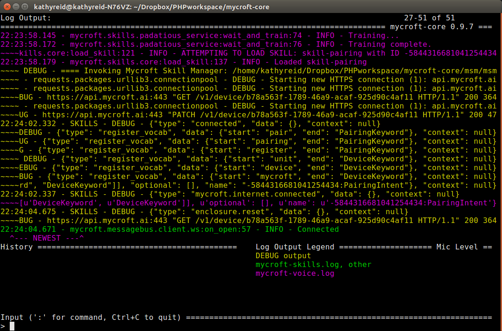

# Contributing to Mycroft

- [Contributing to Mycroft](#contributing-to-mycroft)
  * [I'm non-technical, how do I contribute?](#im-non-technical-how-do-i-contribute)
  * [I'm technically minded, how do I contribute?](#im-technically-minded-how-do-i-contribute)
    + [Reporting Issues](#reporting-issues)
      - [A description of the Issue in object-deviation format](#a-description-of-the-issue-in-object-deviation-format)
      - [The Enclosure or Device you are using, and the version of Mycroft you are using](#the-enclosure-or-device-you-are-using-and-the-version-of-mycroft-you-are-using)
        * [Mark 1 and Picroft](#mark-1-and-picroft)
          + [Mycroft for Linux](#mycroft-for-linux)
    + [Making changes](#making-changes)
  * [Submitting changes for review](#submitting-changes-for-review)
  * [Additional Resources](#additional-resources)

We value and recognise your contributions. Mycroft is artificial intelligence for _everyone_ and we warmly welcome both non-technical and technical contributions.

## I'm non-technical, how do I contribute?

If you're non-technical, there are still many ways to contribute.

* You can contribute your **voice** to the [Mozilla Open Voice Project](https://voice.mozilla.org/)
* You can give us **feedback** on this documentation, using the ratings system you'll see at the bottom of the page
* You can [contact us](https://mycroft.ai/contact) and provide suggestions for improvement or enhancement
* You can join our community through our [Chat](https://chat.mycroft.ai) or [Forum](https://community.mycroft.ai)

## I'm technically minded, how do I contribute?

Great! Let's get you started.

### Reporting Issues

* You'll need a [GitHub account](https://github.com/signup/free)
* Check our [Issues](https://github.com/MycroftAI/mycroft/issues) first to see if the Issue has already been reported.

If not, you'll need to create a new Issue. Help us to help fix the Issue quicker by following these guidelines. Your Issue should contain:

#### A description of the Issue in object-deviation format

Object-deviation format is a very specific way of describing faults. The more specific you can be, the easier it is for us to fix the fault. Begin with the _object_, such as function, a skill, or a hardware feature, then explain the _deviation from the expected condition_.

For example:

* "When my Mycroft Mark 1 device (**object**) powers on, the color of his eyes is red instead of blue (**deviation - red - from expected condition - blue**)
* "When I ask Mycroft about the weather (**object**), Mycroft reports the low temperature correctly, but the high temperature is incorrectly reported as the low temperature (**deviation - incorrect temperature - from expected condition - correct temperature**

#### The Enclosure or Device you are using, and the version of Mycroft you are using

Be sure to let us know the **Enclosure** or **Device** you're using, such as:

* Mark 1
* Mycroft for Linux (please let us know your distro and install method)
* Picroft (let us know which Speakers and Headphones you're using too)

This helps us to pinpoint the issue quickly.

Below, you'll find instructions to identify the version of Mycroft you're using.

##### Mark 1 and Picroft

To find what version of Mycroft your Mark 1 or Picroft is running, you'll need to [SSH into the **Device**](@TODO link to the SSH instructions). Run the command
`apt list`

then look through it to find the Mycroft packages that are installed.

```bash
mycroft-core/unknown,now 0.9.7 armhf [installed,automatic]
mycroft-mark-1/unknown,now 0.9.7 armhf [installed]
mycroft-picroft/unknown 0.9.7 armhf
mycroft-wifi-setup/unknown,now 0.1.5 armhf [installed,automatic]
```

###### Mycroft for Linux

If you're using Mycroft for Linux, you will simply run the CLI, and the CLI will tell you the version number.

`mycroft-core$ ./start-mycroft.sh debug`

```bash
Starting all mycroft-core services
Initializing...
Starting background service bus
Restarting: skills
Restarting: audio
Starting background service voice
Starting cli
```
The version number will be shown in the top right hand corner of the CLI, as shown below.



### Making changes

  1. [Fork the Project](https://help.github.com/articles/fork-a-repo/)
  2. [Create a new Issue](https://help.github.com/articles/creating-an-issue/) if one doesn't already exist.
  3. Create a **feature** or **bugfix** branch based on **dev** with your issue identifier. For example, if your issue identifier is: **issue-123** then you will create either: **feature/issue-123** or **bugfix/issue-123**. Use **feature** prefix for issues related to new functionalities or enhancements and **bugfix** in case of bugs found on the **dev** branch
  4. Make sure you stick to the coding style and OO patterns that are used already.
  5. Document code using [Google-style docstrings](http://sphinxcontrib-napoleon.readthedocs.io/en/latest/example_google.html).  Our automated documentation tools expect that format.  All functions and class methods that are expected to be called externally should include a docstring.  (And those that aren't [should be prefixed with a single underscore](https://docs.python.org/2/tutorial/classes.html#private-variables-and-class-local-references)).
  6. Make commits in logical units and describe them properly. Use your issue identifier at the very begin of each commit. For instance:
`git commit -m "Issues-123 - Fixing 'A' sound on Spelling Skill"`
  7. Before committing, format your code following the PEP8 rules and organize your imports removing unused libs. To check whether you are following these rules, install pep8 and run `pep8 mycroft test` while in the `mycroft-core` folder. This will check for formatting issues in the `mycroft` and `test` folders.
  8. Once you have committed everything and are done with your branch, you have to rebase your code with **dev**. Do the following steps:
      1. Make sure you do not have any changes left on your branch
      2. Checkout on dev branch and make sure it is up-to-date
      3. Checkout your branch and rebase it with dev
      4. Resolve any conflicts you have
      5. You will have to force your push since the historical base has changed
      6. Suggested steps are:
 ```
git checkout dev
git fetch
git reset --hard origin/dev
git checkout <your_branch_name>
git rebase dev
git push -f
```
  9. If possible, create unit tests for your changes
     * [Unit Tests for most contributions](https://github.com/MycroftAI/mycroft-core/tree/dev/test)
     * [Intent Tests for new skills](https://docs.mycroft.ai/development/creating-a-skill#testing-your-skill)
     * We utilize TRAVIS-CI, which will test each pull request. To test locally you can run: `./start.sh unittest`
  10. Once everything is OK, you can finally [create a Pull Request (PR) on Github](https://help.github.com/articles/using-pull-requests/) in order to be reviewed and merged.

**Note**: Even if you have write access to the master branch, do not work directly on master!

## Submitting changes for review

* Push your changes to a topic branch in your fork of the repository.
* Open a pull request to the original repository and choose the right original branch you want to patch.
	_Advanced users may install the `hub` gem and use the [`hub pull-request` command](https://github.com/defunkt/hub#git-pull-request)._
* If not done in commit messages (which you really should do) please reference and update your issue with the code changes. But _please do not close the issue yourself_.
* Even if you have write access to the repository, do not directly push or merge pull-requests. Let another team member review your pull request and approve.

## Additional Resources

* [General GitHub documentation](http://help.github.com/)
* [GitHub pull request documentation](https://help.github.com/articles/about-pull-requests/)
* [Read the Issue Guidelines by @necolas](https://github.com/necolas/issue-guidelines/blob/master/CONTRIBUTING.md) for more details