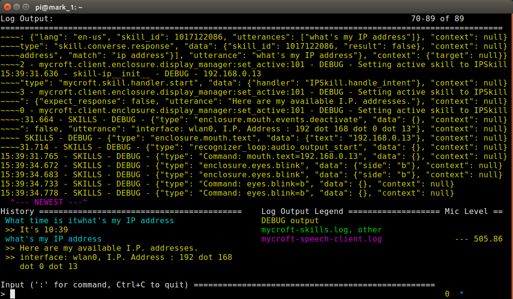
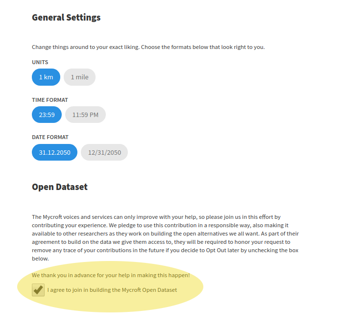

# Mark 1

- [Mark 1](#mark-1)
    + [Prerequisites](#prerequisites)
    + [Getting Started](#getting-started)
      - [Getting Mark 1 connected to the internet using a network cable](#getting-mark-1-connected-to-the-internet-using-a-network-cable)
      - [Getting Mark 1 connected to the internet using Wifi](#getting-mark-1-connected-to-the-internet-using-wifi)
    + [Pairing the Mark 1](#pairing-the-mark-1)
    + [Mark 1 menu options](#mark-1-menu-options)
    + [Hardware information](#hardware-information)
    + [Common tasks performed on the Mark 1](#common-tasks-performed-on-the-mark-1)
      - [Installing Skills on the Mark 1](#installing-skills-on-the-mark-1)
      - [Connecting to the Mark 1 via SSH](#connecting-to-the-mark-1-via-ssh)
      - [Changing the password for the default user via SSH](#changing-the-password-for-the-default-user-via-ssh)
      - [Setting up SSH to the Mark 1 using SSH keys](#setting-up-ssh-to-the-mark-1-using-ssh-keys)
      - [Accessing the command line interface (CLI) of the Mark 1](#accessing-the-command-line-interface-cli-of-the-mark-1)
      - [Enabling the LEARN function](#enabling-the-learn-function)
      - [How to reimage a Mark 1 Device](#how-to-reimage-a-mark-1-device)
        * [Prerequisites](#prerequisites-1)
        * [Reimaging steps](#reimaging-steps)
        * [What should I do if reimaging doesn't work?](#what-should-i-do-if-reimaging-doesnt-work)
      - [Keeping your Mark 1 Device updated](#keeping-your-mark-1-device-updated)
    + [Common issues on Mark 1 Devices](#common-issues-on-mark-1-devices)
    + [Hardware Hacking your Mark 1 Device](#hardware-hacking-your-mark-1-device)

The Mark 1 device is an **Enclosure** for Mycroft, based on Raspberry Pi. It is designed as a reference hardware device, and is able to be easily modified, hacked and extended.

[Mark 1 devices are available in the Mycroft Shop](https://mycroft.ai/shop/?add-to-cart=31440).

_NOTE: Mark 1 devices are currently suitable for hardware hobbyists, developers and hackers. They are not average-consumer ready, but we are anticipating they will be in early 2018. If you have a Mark 1 and you're a general consumer, please leave Mark 1 on a shelf for a few months._)

### Prerequisites

This section of documentation assumes the following:

* That you have a Mycroft Mark 1 hardware **Device**
* That you are comfortable connecting devices to WiFi networks
* That you are comfortable issuing basic Linux commands

### Getting Started

When you received your Mark 1, you would have received a [blue-colored Getting Started guide (PDF, 290Kb)]().

Connect the Mark 1 power supply to a power outlet, and to the Mark 1 device. _NOTE: If you are in a country other than the USA, you will need a power adapter to fit the power outlets in your country_

The Mark 1 will boot up. It will then Speak:

`I need to be connected to the internet. Plug in a network cable, or connect to the SSID Mycroft with the password 12345678 and go to http://start.mycroft.ai`

#### Getting Mark 1 connected to the internet using a network cable

Plug the Mark 1 into your router using an ethernet cable.
@TODO This didn't work on my Mark 1, so I'm not sure what should happen when the Mark 1 is connected to the router via network cable.

#### Getting Mark 1 connected to the internet using Wifi

Using your computer or a mobile device, connect to the Wifi SSID `MYCROFT` using the password `123456787`. Once you are connected to this SSID, go to the web page [http://start.mycroft.ai](https://start.mycroft.ai). A list of available WiFi networks will be presented. Select the WiFi network that you wish to connect the Mark 1 to, and enter the WiFi password. Mark 1 will attempt to connect to the WiFi network.

_NOTE: Mark 1 cannot connect to WiFi networks that operate in the 5GHz band. You must select a WiFi network that operates in the 2.4GHz band._

@TODO I don't know what the limitations are around the WiFi networks that Mycroft can connect to - for instance, can Mycroft connect to WiFi networks that use certain types of authentication like WEP, or enterprise WPA2-PSK with things like Radius that are used in the enterprise? Don't know, flagging as @TODO

### Pairing the Mark 1

Once the Mark 1 is connected to the internet, a **Registration Code** will be Spoken, and displayed on the Mark 1's LED panel.

[View the home.mycroft.ai documentation to learn how to add your **Device** to home.mycroft.ai](/03.your-home.mycroft.ai-account/01.your-home.mycroft-account.md).

Once paired, you can then use [basic **skills**](../03.your-home.mycroft.ai-account/02.basic-commands.md).

### Mark 1 menu options

You can access the Mark 1 menu by pressing the top button for two seconds. Turn the top button anti-clockwise to scroll through menu options, then press the button to select that option.  

The available menu options are:

* ILLUM: This option allows you to control the brightness of Mark 1's Eyes, on a scale of 0 (eyes off) to 30 (maximum brightness). The *Auto* setting will set the brightness to 30, which is the maximum setting.

* WIFI: This option allows you to connect or re-connect Mark 1 to your WiFi. This option is useful if your router changes, or your WiFi password changes, or you're moving your Mark 1 to a new location.

* REBOOT: This option will reboot your Mark 1. _NOTE: The reboot is immediate_. This option is useful if you're experiencing issues with your Mark 1, or may be required as part of troubleshooting measures.

* OFF: This option will put your Mark 1 into Standby Mode. You won't be able to use the **Wake Word** or make **Utterances** while Mark 1 is in Standby Mode. To wake Mark 1 up from Standby, press the top button for two seconds.

* TEST: This option will immediately run a test sequence on your Mark 1. This option may be required as part of troubleshooting measures. To move through each of the tests, press the top button. Continue pressing the top button to exit the test sequence.

* SSH: This option allows you to enable [SSH](https://en.wikipedia.org/wiki/Secure_Shell) connections to the Mark 1 Device, or to block SSH if it's enabled.

* LEARN: This option allows you to enable the Learn functionality within Mycroft. If you've also opted-in on home.mycroft.ai, and Learn functionality is enabled, then Mycroft will record your voice when Speaking the **Wake Word** and **Utterances**. This data is then used anonymously to _train_ Mycroft to better recognize the **Wake Word** and **Utterances**.

* RESET: This option resets Mark 1 back to a factory default state. You may need to do this for troubleshooing, or if you're giving your Mark 1 to someone else. _NOTE: If you're resetting your Mark 1, remember to remove the Device from home.mycroft.ai so that the Pairing is removed also_

* DEMO: If this option is selected, Mark 1 will provide a short demonstration of functionality, whilst channelling his secret desire to be Eminem :-)

### Hardware information

### Common tasks performed on the Mark 1

#### Installing Skills on the Mark 1

[Please refer to the information here](/03.your-home.mycroft.ai-account/02.basic-commands.md#installing-new-skills)

#### Connecting to the Mark 1 via SSH

* First, ensure that you've enabled SSH access.
* Ensure you know the IP address of your Mark 1 Device on your network. A handy way to do this is to install the IP Address **Skill**, and then Speak:

`hey mycroft, what's your IP address?`

`here are my available IP addresses: wlan IP address ... Those are all my available IP addresses`

* Open up your favorite terminal program, like PuTTy on Windows, or a new terminal on Linux
* `ssh pi@IPADDRESS`
* The default password is `mycroft`, so enter this when prompted.
* If you have successfully logged in via SSH you will see a command prompt like the one below:

```
$ ssh pi@192.168.0.13
pi@192.168.0.13's password:

The programs included with the Debian GNU/Linux system are free software;
the exact distribution terms for each program are described in the
individual files in /usr/share/doc/*/copyright.

Debian GNU/Linux comes with ABSOLUTELY NO WARRANTY, to the extent
permitted by applicable law.
Last login: Wed Oct 18 13:02:44 2017
pi@mark_1:~ $
```

You are now connected to the Mark 1 via SSH.

#### Changing the password for the default user via SSH

@TODO for discussion - I don't really want to include this because it will make troubleshooting basic errors much harder if beginner level developers change the pi user password. If people are advanced, they will figure out how to change the password.  

#### Setting up SSH to the Mark 1 using SSH keys

If you would like to set up SSH access to  your Mark 1 device using SSH keys instead of a password, then follow [this guide on the Raspberry Pi documentation](https://www.raspberrypi.org/documentation/remote-access/ssh/passwordless.md).

#### Accessing the command line interface (CLI) of the Mark 1

If you are SSH'd into the Mark 1 device, you are able to issue commands using the command line interface (CLI) instead of using voice. This bypasses the Speech To Text (STT) component of Mycroft.

`python -m mycroft.client.text.main --quiet`

You will now be able to type **Utterances** into the CLI.



#### Enabling the LEARN function

The Learn functionality

If you've also opted-in on home.mycroft.ai, and Learn functionality is enabled, then Mycroft will record your voice when Speaking the **Wake Word** and **Utterances**. This data is then used anonymously to _train_ Mycroft to better recognize the **Wake Word** and **Utterances**.

To enable the Learn functionality:

1. Make sure that you've checked the 'Opt In' checkbox at [home.mycroft.ai](https://home.mycroft.ai), Settings -> Basic.



2. Next press the top button on your Mark 1. Turn the button to LEARN. Press the top button again. Turn the button to ALLOW. Mycroft will Speak:

`I will now upload interaction data to help make me smarter`

#### How to reimage a Mark 1 Device

##### Prerequisites

To reimage a Mark 1 **Device**, you will need:

* A MicroSD card reader - whether this is built in to your computer or works via USB adapter.
* You will need [Etcher](https://etcher.io/), a disk image writer, or equivalent software that writes disk images to a MicroSD card
* A torque screwdriver to unscrew the torque screws on the Mark 1 **Device**

##### Reimaging steps

* Download the software image. Save it to your computer. [The Mark 1 disk image is available here](https://mycroft.ai/to/mark-1-image)
* Disconnect your Mark 1 from the power supply.
* Using your torque screwdriver, take apart your Mark 1. If you need help, [this video from Geeked Out Solutions may be of assistance](https://www.youtube.com/watch?v=r76ObbB2EsA).
* Remove the Micro SD card from the Raspberry Pi board on the back of the Mark 1 unit. It should come out easily, and should not need to be forced.
* Insert the Micro SD card into the SD card slot on your computer. If your computer doesn't have a Micro SD card slot, you will need an external Micro SD card reader, or a SDHC card reader with a converter.
* Open Etcher, and follow the steps to burn the Mark 1 disk image that you downloaded in the first step onto the Micro SD card.
* Remove the Micro SD card from your computer / adapter and insert it into the Micro SD slot on the Raspberry Pi. Then, put the Mark 1 unit back together using the torque screws and screwdriver.
* Connect the Mark 1 unit back to the power supply.
* The Mark 1 unit should reboot and now be functioning correctly.

For more information, [see the original forum post by Barney Woodrow](https://community.mycroft.ai/t/how-to-re-image-mark1s-sd-card/2106).

##### What should I do if reimaging doesn't work?

Micro SD cards have a finite lifespan. It is possible that the Micro SD card inside the Raspberry Pi inside the Mark 1 unit has suffered hardware failure. If this occurs, you will see symptoms such as:

* Mark 1 not booting successfully
* Strange appearance of _eyes_ and _mouth_
* Mark 1 will be unresponsive to voice commands

If you believe your Micro SD card might have failed, [please make contact with us so we can look into the issue further with you](https://mycroft.ai/contact/), and if warranted, provide a replacement.   

#### Keeping your Mark 1 Device updated

Your Mark 1 device will check for updates around every hour. If new software is available, Mark 1 will automatically download the updates and apply them.

There's nothing else you need to do.

### Common issues on Mark 1 Devices

@TODO link to Troubleshooting

### Hardware Hacking your Mark 1 Device

@TODO need to touch base with @penrods on what should go in here