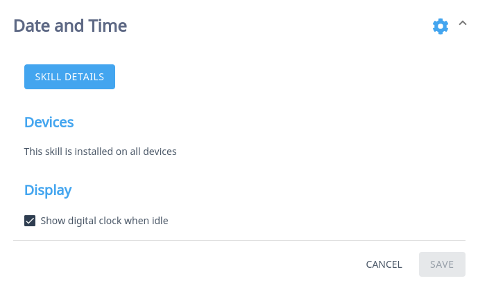

# Skill Settings

Skill settings provide the ability for users to configure a Skill using a web-based interface. This is often used to:

* Change default behaviors - such as the sound used for users alarms.
* Authenticate with external services - such as Spotify
* Enter longer data as text rather than by voice - such as the IP address of the users Home Assistant server.

Skill settings are completely optional.

## Define settings for a Skill

To define our Skills settings we use a `settingsmeta.json` or `settingsmeta.yaml` file. This file must be in the root directory of the Skill and must follow a specific structure.

### Example settings file

To see it in action, lets look at a simple example from the [Mycroft Date-Time Skill](https://github.com/MycroftAI/skill-date-time). First using the JSON syntax as a `settingsmeta.json` file:

```javascript
{
    "skillMetadata": {
        "sections": [
            {
                "name": "Display",
                "fields": [
                    {
                        "name": "show_time",
                        "type": "checkbox",
                        "label": "Show digital clock when idle",
                        "value": "false"
                    }
                ]
            }
        ]
    }
}
```

Now, here is the same settings, as it would be defined with YAML in a `settingsmeta.yaml` file:

```yaml
skillMetadata:
   sections:
      - name: Display
        fields:
          - name: show_time
            type: checkbox
            label: Show digital clock when idle
            value: "false"
```

Notice that the value of `false` is surrounded by "quotation marks". This is because Mycroft expects a string of `"true"` or `"false"` rather than a Boolean.

Both of these files would result in the same settings block.



It is up to your personal preference which syntax you choose.

### Structure of the settingsmeta file

Whilst the syntax differs, the structure of these two filetypes is the same. This starts at the top level of the file by defining a `skillMetadata` object. This object must contain one or more `sections` elements.

#### Sections

Each section represents a group of settings that logically sit together. This enables us to display the settings more clearly in the web interface for users.

In the simple example above we have just one section. However the [Spotify Skill settings](https://github.com/forslund/spotify-skill/blob/19.08/settingsmeta.json) contains two sections. The first is for Spotify Account authentication, and the second section contains settings to define your default playback device.

Each section must contain a `name` attribute that is used as the heading for that section, and an Array of `fields`.

#### Fields

Each section has one or more `fields`. Each field is a setting available to the user. Each field takes four properties:

* `name`    \(String\)  

  The `name` of the `field` is used by the Skill to get and set the value of the `field`. It will not usually be displayed to the user, unless the `label` property has not been set.

* `type`    \(Enum\)  

  The data type of this field. The supported types are:

  * `text`: any kind of text
  * `email`: text validated as an email address
  * `checkbox`: boolean, True or False
  * `number`: text validated as a number
  * `password`: text hidden from view by default
  * `select`: a drop-down menu of options
  * `label`: special field to display text for information purposes only. No name or value is required for a `label` field.

* `label`    \(String\)  

  The text to be displayed above the setting field.

* `value`    \(String\)

  The initial value of the field.

Examples for each type of field are provided in JSON and YAML at the end of this page.

## Using settings in your Skill

Once settings have been defined using a `settingsmeta` file, they will be presented to the user on their personal [Skill Settings page](https://home.mycroft.ai/skills).

When settings are fetched from the Mycroft server, they are saved into a `settings.json` file, also in the Skills root directory. This file is automatically created when a Skill is loaded even if the Skill does not have any settings. Your Skill then accesses the settings from this file.

### Reading settings

Skill settings are available on the MycroftSkill class and inherit from a Python Dict. This means that you can use it just like you would any other Python dictionary.

To access the `show_time` variable from our example above we would use the `Dict.get` method:

```python
self.settings.get('show_time')
```

If the setting we are trying to access is not available, the `get` method will return `None`. Instead of assigning this to a variable and then testing for `None`, we can provide a default value as the second argument to the `get` method.

```python
self.settings.get('show_time', False)
```

In this example, if the settings have not been received, or the `show_time` setting has not been assigned, it will return the default value `False`.


**A few warnings**


We recommend using the `Dict.get` method above rather than accessing the setting directly with:

```python
self.settings['show_time']
```

Directly referencing the value may throw a KeyError if the setting has not yet been fetched from the server.

It is also important to note that the `settings` dictionary will not be available in your Skills `__init__` method as this is setting up your Skills Class. You should instead use an `initialize` method which is called after the Skill is fully constructed and registered with the system. More detail is available at:



### Handling settings changes

Each Mycroft device will check for updates to a users settings regularly, and write these to the Skills `settings.json`. To perform some action when settings are updated, you can register a callback function in your Skill.

```python
def initialize(self):
  self.settings_change_callback = self.on_settings_changed
  self.on_settings_changed()

def on_settings_changed(self):
  show_time = self.settings.get('show_time', False)
  self.trigger_time_display(show_time)
```

In the example above, we have registered the `on_settings_changed` method to be our callback function. We have then immediately called the method to perform the relevant actions when the Skill is being initialized even though the Skills settings have not changed.

In the `on_settings_changed` method we have assigned the value of the `show_time` setting to a local variable. Then we have passed it as an argument to another method in our Skill that will trigger the display of the time based on its value.

### Writing to settings

Your Skill can reassign a setting locally, however these values remain local and cannot be pushed to the server. To do this we assign a value like you would with any other dictionary key.

```python
self.settings['show_time'] = True
```

The new value for the `show_time` setting will persist until a new setting is assigned locally by the Skill, or remotely by the user clicking `save` on the web view.

## Settings Field Examples

### Label Field



```javascript
{
    "skillMetadata": {
        "sections": [
            {
                "name": "Label Field Example",
                "fields": [
                    {
                        "type": "label",
                        "label": "This is descriptive text."
                    }
                ]
            }
        ]
    }
}
```



```yaml
skillMetadata:
   sections:
      - name: Label Field Example
        fields:
          - type: label
            label: This is descriptive text.
```



### Text Field



```javascript
{
    "skillMetadata": {
        "sections": [
            {
                "name": "Text Field Example",
                "fields": [
                    {
                        "name": "my_string",
                        "type": "text",
                        "label": "Enter any text",
                        "value": ""
                    }
                ]
            }
        ]
    }
}
```



```yaml
skillMetadata:
   sections:
      - name: Text Field Example
        fields:
          - name: my_string
            type: text
            label: Enter any text
            value:
```



### Email



```javascript
{
    "skillMetadata": {
        "sections": [
            {
                "name": "Email Field Example",
                "fields": [
                    {
                        "name": "my_email_address",
                        "type": "email",
                        "label": "Enter your email address",
                        "value": ""
                    }
                ]
            }
        ]
    }
}
```



```yaml
skillMetadata:
   sections:
      - name: Email Field Example
        fields:
          - name: my_email_address
            type: email
            label: Enter your email address
            value:
```



### Checkbox



```javascript
{
    "skillMetadata": {
        "sections": [
            {
                "name": "Checkbox Field Example",
                "fields": [
                    {
                        "name": "my_boolean",
                        "type": "checkbox",
                        "label": "This is an example checkbox. It creates a Boolean value.",
                        "value": "false"
                    }
                ]
            }
        ]
    }
}
```



```yaml
skillMetadata:
   sections:
      - name: Checkbox Field Example
        fields:
          - name: my_boolean
            type: checkbox
            label: This is an example checkbox. It creates a Boolean value.
            value: "false"
```



### Number



```javascript
{
    "skillMetadata": {
        "sections": [
            {
                "name": "Number Field Example",
                "fields": [
                    {
                        "name": "my_number",
                        "type": "number",
                        "label": "Enter any number",
                        "value": "7"
                    }
                ]
            }
        ]
    }
}
```



```yaml
skillMetadata:
   sections:
      - name: Number Field Example
        fields:
          - name: my_number
            type: number
            label: Enter any number
            value: 7
```



### Password



```javascript
{
    "skillMetadata": {
        "sections": [
            {
                "name": "Password Field Example",
                "fields": [
                    {
                        "name": "my_password",
                        "type": "password",
                        "label": "Enter your password",
                        "value": ""
                    }
                ]
            }
        ]
    }
}
```



```yaml
skillMetadata:
   sections:
      - name: Password Field Example
        fields:
          - name: my_password
            type: password
            label: Enter your password
            value:
```




### Select



```javascript
{
    "skillMetadata": {
        "sections": [
            {
                "name": "Select Field Example",
                "fields": [
                    {
                      "name": "my_selected_option",
                      "type": "select",
                      "label": "Select an option",
                      "options": "Option 1|option_one;Option 2|option_two;Option 3|option_three",
                      "value": "option_one"
                    }
                ]
            }
        ]
    }
}
```



```yaml
skillMetadata:
   sections:
      - name: Select Field Example
        fields:
          - name: my_selected_option
            type: select
            label: Select an option
            options: Option 1|option_one;Option 2|option_two;Option 3|option_three
            value: option_one
```


