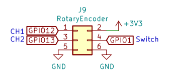

# Mark II

The Mark II Dev Kit is intended for Software Developers and Hardware Developers to develop on the Mycroft platform. 

## Constructing your Dev Kit

Being a development kit, there's a small amount of construction required.

We have put together a detailed set of instructions to help get you setup. These instructions include the laser cut enclosure, 3D printed audio chamber and camera module.

‌[https://www.instructables.com/Mycroft-Mark-II-Developer-Kit-Assembly/](https://www.instructables.com/Mycroft-Mark-II-Developer-Kit-Assembly/)

### Buttons

The Mark II, including the Dev Kit, comes with 3 buttons and 1 switch. These are all located on the SJ201 board.

1. Action - the button located in the center of the LED ring. This activates the listener if needed.
2. Volume Up - the button on the front-right of the board when looking at the screen.
3. Volume Down - the button in the front-center of the board.
4. Mic hardware cut-off - a physical disconnect switch for the microphones. Switch left to disable the microphones, and right to re-enable them.

### LEDs

The SJ201 comes with 12 LEDs in a ring formation. 

Currently there are two "dedicated" LED's for development purposes only \(these will change as we approach a general release\):

* One led is green/red representing the current state of the microphone mute.
* The second shows the general CPU temperature
  * Blue = cold
  * Magenta = warm
  * Orange = hot 
  * Red = very hot

The LED ring has a number of states:

* Blue and spinner - listener is activated such as when the wake word is detected.
* Pulsing ring - device is thinking.

### Further information

You can find detailed information on all components of the Mark II hardware on [our Github](https://github.com/MycroftAI/hardware-mycroft-mark-II/tree/master/mark-II-Rpi-devkit).

## Software

### Installing the Operating System

Download the latest version of the Mark II operating system from:

[https://mycroft.ai/to/mark-ii-stable](https://mycroft.ai/to/mark-ii-stable)

Using a tool like the [Raspberry Pi Imager](https://www.raspberrypi.org/software/), flash the downloaded image onto the USB drive provided with your Mark II Dev Kit. To get the most from this drive, be sure to plug it into the top left USB port which is blue indicating it is USB 3.0.

### First boot

‌When you power on the device for the first time, Mycroft will walk you through setting up your WiFi and pairing the device to your Mycroft account. If you haven’t yet registered, you can create an account at [https://home.mycroft.ai](https://home.mycroft.ai).

### Known Issues

The software on the Mark II Dev Kit is still an early release. Please help us improve the Mark II by [opening a bug report or feature request](https://github.com/MycroftAI/hardware-mycroft-mark-II/issues/new/choose) for anything that doesn't seem right.

There are a number of known issues that we are working through at the moment. These include:

* The Wifi Connect application does not yet support hidden SSID's. 
  * Workaround - ensure your network SSID is visible.
* Cannot poweroff the device. The system currently fails on shutdown and eventually reboots. 
  * Workaround - select reboot / poweroff, then wait 5 seconds before unplugging the device.
  * This also affects reboot, taking a long time to cycle - you can safely remove and re-insert the power cable after a 5 seconds to speed up the process.
* Additional settings in on screen menu not yet implemented: 
  * On screen Wifi setup
  * Factory reset
  * Update Device

## SSH Access

To enable secure access to your device, we use public-key cryptography rather than a default username and password. 

In short this means that you generate what’s known as a key-pair. The pair is made up of two files - a public key and a private key. The public key is transferred to your device, and only your private key will be able to log in to it. Your private key is like an extremely secure password and you should never share this with anyone. If you want to learn more about the details, start here.

### Generating a key-pair

#### Linux

1. Open your terminal and run:   `ssh-keygen -t rsa`
2. You will be asked where to save your new key-pair Leave this blank if you would like to use the default location `/home/user/.ssh/id_rsa`
3. You can optionally add a passphrase.  This is an additional layer of security that will require you to enter your passphrase when using your private key. 
4. If you selected the default file path you will have two new files: `/home/user/.ssh/id_rsa` is your private key - again do not share this. `/home/user/.ssh/id_rsa.pub` is your public key - this can be shared.

#### Public Key Contents

If you read the contents of your public key it will look something like this:

`ssh-rsa AAAAB3NzaC1yc2EAAAADAQABAAABAQDSUOctoVJ5nwQO0I9c8gIK0ijYbOCZKdVmAu8jG0Znl2zvZLFYI7bGFbt/Rr8vjFVh4I2srFB52duirX53LtZF2ZUKMI+8ivaLk+pD7M0WL+sbG1jU2S/IdCUi7HmZ/fSp89UJb23i9Q9AINFdw+0spCjJSWB8+3wGQ4bPUSbNLCtsYv1anO+B26PIN5E9R0X84IVq+x41B1swvlUt15zfMwA7Jhl5fJgl6XzhNYcMdH/qp+r7Ij2d7NM9YR6/yva4/QLqzbPCoelxJLpVHKZ0ZLnhvYOoxRbLbU46AgTljGM3Z7rcvxm2Vl107ZojljuvF6cMXM4NU4peVimn5XOP gez@example`  
This includes three things:

* The encryption protocol used - `ssh-rsa`
* The public key - a seemingly random string
* An identifier of the creator - `gez@example`

### Adding your public key to your Mycroft account

Now that you have your key-pair setup, you can add it to any of your Mycroft devices at: [https://home.mycroft.ai/devices](https://home.mycroft.ai/devices)

If you need to add multiple public keys to a device, put each new key on a new line. For example:

> ssh-rsa publickeystring gez@example  
> ssh-rsa differentkeystring gez@example

Your Mark II device will then fetch these public keys from your Mycroft account.

### SSH in to your device

With your public key on your Mark II, and your private key remaining securely on your local machine, you can now SSH into the device.


You can find the IP address of your device by saying "Hey Mycroft, what is my IP Address?".


```bash
ssh -p 8222 mycroft@$YOUR_IP
```

You will now be logged in as the `mycroft` user, with the virtual environment active. Your prompt should look like:

```bash
(.venv) mycroft@localhost:~$
```

From here you can interact with the device as you would any other Linux system. Mycroft's standard tooling is also available including:

* `mycroft-cli-client` - a terminal based graphical interface for the system
* `mycroft-msm` - Mycroft Skills Manager - for installing, removing, and updating Skills
* `mycroft-msk` - Mycroft Skills Kit - for quickly generating new Skill templates
* `mycroft-skill-testrunner` - for running Skill integration tests

#### Multiple containers

There are 3 areas that make up the operating system on your Mark II:

* `mycroft` container - contains everything you would expect and is built on a base of Ubuntu 20.04.
* `awconnect` container - contains the WiFi setup application and manages the network connections.
* `_pv_` \(Pantavisor\) initrd view - boots the system, manages the other containers as well as updates.

You can SSH into both of these containers and the initrd view by using the container name as the username. For example to SSH into `awconnect` you would run:

```bash
ssh -p 8222 awconnect@$YOUR_IP
```

Or to SSH into the Pantavisor initrd view you would run:

```bash
ssh -p 8222 _pv_@$YOUR_IP
```

There is also a BSP layer that can be mounted for inspection on another machine. This contains the kernel, modules and firmware.

### Transfer files to or from your device

Now that you have SSH access, you can transfer files to and from your device using `scp`.To do this, we also need to use the port 8222, however unlike `ssh` the `scp` command uses the uppercase `-P` flag 🤷 

Lets transfer `my_file` from our computer, to the Mark II device:

```bash
scp -P 8222 my_file mycroft@$YOUR_IP:/destination/path/
```

We can also transfer files in the other direction. Let's grab all of the Mycroft log files in one command using the `-r` recursive flag:

```bash
scp -rP 8222 mycroft@$YOUR_IP:/var/log/mycroft /destination/path/
```

## Skill Development

### Creating your first Skill

To create your first Skill run:

```bash
mycroft-msk create
```

Then see our detailed Skill development documentation:



### Installing Skills still in development

Mycroft Skills Manager \(MSM\) is a command line tool used to add, manage and remove Skills on any Mycroft installation. It can install any Skill listed on the [Mycroft Skills Repository](https://github.com/MycroftAI/mycroft-skills) or from any Github repository. 



### Creating a custom idle screen

The idle screen \(also called a Home screen\) on the Mark II is fully customizable. The default screen is provided by the [Time Date Skill](https://github.com/MycroftAI/skill-date-time/blob/b5b7ded3149c1929b46c2e294fc6980325416cf6/__init__.py#L85) but you can create your own. 

Here we have a [simple example Skill](https://github.com/krisgesling/gez-homescreen-skill/) that allows the user to set their idle screen to be an image from a remote url through the Skill's settings. 

To switch between the available screens, pull down from the top of your screen to access the on device menu and select Additional Settings &gt; Homescreen. As new options are added to Skills they will automatically show up in this list.

## Mycroft-Core Development

Before making changes to `mycroft-core` on the Mark II Dev Kit it's recommended that you disable automatic updates in your [device settings](https://home.mycroft.ai/devices).

To return to a production state, it is recommended that you flash a fresh image of the Mark II OS.

Mycroft-core is installed at `/opt/mycroft/` 

## FAQ

### How are updates handled?

Automatic updates can be disabled or re-enabled from the [Device Settings in your Mycroft account](https://home.mycroft.ai/devices).

By default, your Mark II checks for updates on a regular basis. When an update is available, it will apply it after a preset delay. 

When requesting an update your device will fetch this directly from Pantacor’s servers. As we've always done, connections are initiated by the Mycroft Mark II. The server cannot initiate a connection with a device.

### **Who are Pantacor?**

The Mycroft Mark II uses [Pantacor](https://pantacor.com/) to provide system updates. 

Mycroft has partnered with Pantacor to provide a comprehensive and robust software life-cycle management solution. It is an open source solution that uses container technologies to securely and reliably maintain edge services on Linux devices. 

For the Mark II this provides a very stable and resilient operating system and update service. If something goes wrong on your Mark II, the device will automatically roll back to a previously working state.

The team at Pantacor share our commitment to open source, privacy and security. [Pantacor’s co-founders](https://www.pantacor.com/about/) also have a strong reputation to back that up. Furthermore, as they are constituted in Europe, they must also meet the EU’s strict regulatory guidelines including the GDPR.

### Do I need an account with Pantacor?

No, your Mycroft account handles everything and is the only account you need. 

### What is pantavisor?

Pantavisor is open source software from Pantacor that manages the containers on your device and handles the update processes. You can find the source code for it [here on Pantacor’s Gitlab](https://gitlab.com/pantacor/pantavisor).

In more technical terms, Pantavisor is a device-side initrd base system which assembles a userland made up of one-to-many containers. On the Mark II, it starts the awconnect container, providing networking and connectivity, and the mycroft container that contains everything that runs the Mycroft application including mycroft-core, mycroft-gui, Skills and all the dependencies for these.

For further information on Pantacor check out:

* [https://docs.pantahub.com/pantavisor-architecture/](https://docs.pantahub.com/pantavisor-architecture/)
* [https://www.pantacor.com](https://www.pantacor.com)
* [https://hub.pantacor.com](https://hub.pantacor.com)

### What is device cloning?

Pantacor provides a method of cloning the configuration or “factory state” of a device, or any pristine update state that is available for a device. This is the configuration and other static assets used to generate or update an image. It does not, and cannot, clone the contents of your device. It cannot read your filesystem. A “clone” does not contain any of your Skills, Skill settings, data or other files. 

Device cloning would not be useful to perform on any end-users device. It is only useful during development to share modified system configurations with other developers.

### Are you monitoring my usage?

Mycroft is opt-out by default. That means if you haven’t explicitly opted-in to share your data with us, then we do not keep it. Any queries sent to our back end services are processed and then deleted immediately.

General usage statistics, such as how many unique devices have connected to our servers in a given day are collected and kept in aggregate. This allows us to see general user trends, but again, if you haven’t opted-in we would not know whether any device from a specific account was even turned on any previous day.

Our [privacy policy](https://mycroft.ai/embed-privacy-policy/) outlines in greater detail how and when we collect and store your information.

### How does the SSH connection work?

In developer mode, the Pantavisor system provides an SSH bridge running on port 8222. This bridge allows you to enter a shell session into any running container, regardless of whether that container is running an SSH server by itself. Due to the developer-friendly nature of the Mark II, this is enabled by default however no access is allowed until an SSH key is added to the Mycroft management panel.

In previous devices like the Mark 1, we provided the ability to turn SSH on and off because they operated off a default username and password. Distributing an internet connected device with a default username and password providing shell access is a very big security risk. Hence the SSH service had to be disabled by default. 

The use of a key-pair removes the need to disable the SSH server. Without a public key on the device, and the ability to connect to your device on port 8222, no one can SSH into it.

### I used a different Raspberry Pi and it won't boot!?!

First, we recommend using the Pi that ships with your device.

If you need to switch this out, please note that there are some revision 1.4 Raspberry Pi's that ship with firmware that does not support USB boot. To update the firmware, you can flash the [Mark II image](https://mycroft.ai/to/mark-ii-stable) onto a Micro SD card. This will automatically update your firmware to a supported version on first boot. From then on you can boot from USB or continue using the Micro SD card.

### Where is \_\_\_\_\_\_\_\_ package?

The Mark II is intended to be a device for consumers. As such we try to keep the system as lean as possible. How lean? Currently it is "no-installed-text-editor" lean!

The `mycroft` container however is based on Ubuntu 20.04 so all of your standard tooling is available via the apt package manager. 

### Which GPIO pins are available?

The Raspberry Pi GPIO pins 1, 12 and 13 are brought out to J9 on the SJ201. This is next to the volume up button on the front-right of the board if you are looking at the device face on. GPIO pin 0 is also not used.



## More questions?

Join us in [Mycroft Chat](https://chat.mycroft.ai/community/channels/mark2) or the [Community Forums](https://community.mycroft.ai/c/mark2/), we’re happy to answer any other questions you might have.

